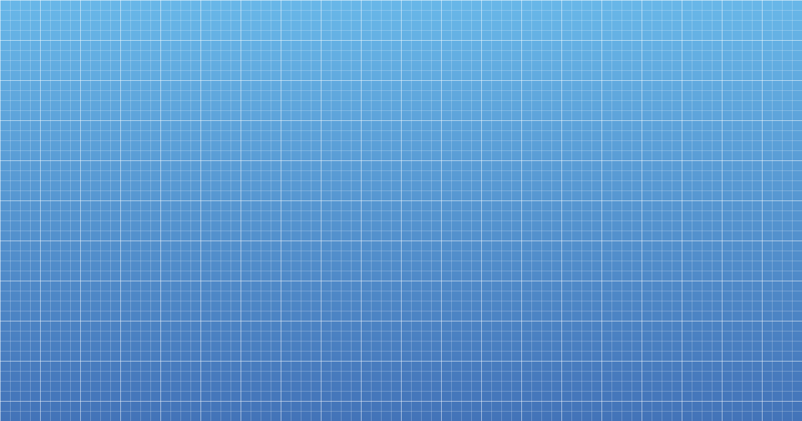

# pixelruler

Online pixel ruler and grid overlay at [pixelruler.dev](https://pixelruler.dev).



## Features

- Adjustable grid spacing (16–256px)
- Subdivisions between main grid lines (1–12)
- Cursor position tooltip
- Retina-ready canvas rendering

## Stack

Next.js, TypeScript, styled-components, Popper.js

## Development

```
corepack enable
yarn install
yarn dev
```

## License

MIT
